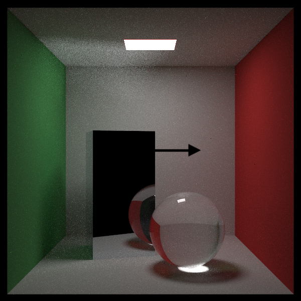

# Ray Tracing in The Next Week Node版本的实现

# 中文翻译教程
[Ray Tracing in The Rest of Your Life 1](https://zhuanlan.zhihu.com/p/371231759)

[Ray Tracing in The Rest of Your Life 2](https://zhuanlan.zhihu.com/p/371251550)


# 英文原教程

[Ray Tracing in The Rest of Your Life](https://raytracing.github.io/books/RayTracingTheRestOfYourLife.html)


# 运行示例

```shell
    yarn start
```
由于CPU计算比较慢，再加上我构建了一张600 * 600 采用1000的采样率，最终大约需要等待9个多小时，才能看到以下的效果。

> 代码中注释纯属于个人理解，如果不对的地方，请在issue中指正


# 最终渲染的效果




# 最后

    光线追踪目前看来应该是未来的趋势，我们的路还很长，需要大家不断地劈荆斩棘，开辟一条通往光明的大道！


